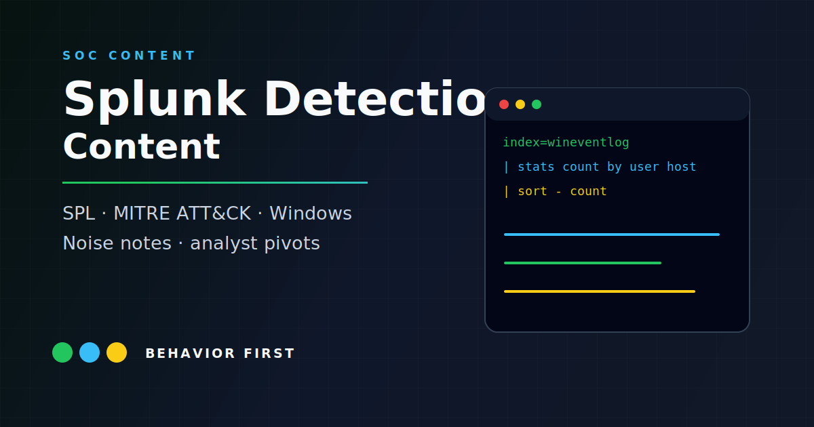

# Splunk Detection Content



This is a Splunk detection and triage notebook organized by [MITRE ATT&CK](https://attack.mitre.org/) tactic. The content is written around Windows-centric lab environments with Active Directory, Sysmon, PowerShell logging, and standard Windows Security events.

The point is not to dump searches or pretend they are production-ready out of the box. Each detection is written like an analyst note: what behavior it looks for, what data it assumes, what tends to be noisy, and what I would check next before escalating.

The searches are based on lab practice, public technique research, and sanitized detection-writing exercises. They are meant to show security operations thinking: behavior, assumptions, tuning, triage context, and short playbook-style review paths.

Each query includes:
- **What it detects** - the behavior or indicator being hunted
- **ATT&CK mapping** - tactic and technique reference
- **Required data sources** - index/sourcetype assumptions
- **SPL** - copy-paste ready, with field assumptions called out
- **Tuning notes** - known FP sources and how to reduce noise
- **Analyst next steps** - pivots I would use before calling something suspicious

Each playbook includes:
- **Scope** - the behavior and related query notes covered
- **Triage flow** - the order I would check context
- **Key pivots** - fields, logs, and related activity worth reviewing
- **Escalation and closure criteria** - when to keep digging and when the event likely fits known-good behavior

---

## Scope

This is a detection notebook, not a managed detection product.

Use it to review:

- how I translate attacker behavior into SPL
- what data sources each search assumes
- where false positives are likely
- what I would check before escalation
- how short playbooks turn a query hit into a review path
- how lab and TryHackMe-style practice can become documented detection logic

Do not use it as-is in a live Splunk environment without adapting indexes, sourcetypes, field names, baselines, and allowlists.

## How I Review a Detection

1. Start with behavior, not a tool name.
2. Confirm the data source can actually see that behavior.
3. Write the first SPL version as a visibility search.
4. Add grouping, thresholds, and fields that help a person decide.
5. Tune known-good admin activity without hiding rare activity.
6. Document what to check next so the alert does not stop at "interesting."

That last part matters. A detection that does not tell the next analyst where to pivot is only half finished.

## Data Source Assumptions

| Log Source | Sourcetype | Notes |
|---|---|---|
| Windows Security Events | `WinEventLog:Security` | Audit policy: logon, account mgmt, object access |
| Sysmon | `XmlWinEventLog:Microsoft-Windows-Sysmon/Operational` | Config: SwiftOnSecurity or olafhartong |
| PowerShell | `WinEventLog:Microsoft-Windows-PowerShell/Operational` | Script block logging enabled |
| Windows System | `WinEventLog:System` | Service installs, task scheduler |
| DNS | `stream:dns` or vendor-specific | Forward + reverse lookups |

---

## Query Index

| File | Tactic | Techniques Covered |
|---|---|---|
| [persistence.md](queries/persistence.md) | Persistence | T1053.005, T1547.001, T1543.003 |
| [credential-access.md](queries/credential-access.md) | Credential Access | T1110.001, T1558.003, T1003.001 |
| [lateral-movement.md](queries/lateral-movement.md) | Lateral Movement | T1021.002, T1021.006, T1550.002 |
| [defense-evasion.md](queries/defense-evasion.md) | Defense Evasion | T1070.001, T1562.001, T1036.005 |
| [discovery.md](queries/discovery.md) | Discovery | T1135, T1087.002, T1046 |
| [execution.md](queries/execution.md) | Execution | T1059.001, T1204, T1105, T1218 |
| [initial-access.md](queries/initial-access.md) | Initial Access | T1566.001, T1566.002 |
| [exfiltration.md](queries/exfiltration.md) | Exfiltration | T1041, T1567.002 |

## Playbook Index

| File | Related detections | Focus |
|---|---|---|
| [persistence-triage.md](playbooks/persistence-triage.md) | `queries/persistence.md` | Scheduled tasks, Run keys, new services |
| [credential-access-triage.md](playbooks/credential-access-triage.md) | `queries/credential-access.md` | Brute force, Kerberoasting, LSASS access |
| [execution-triage.md](playbooks/execution-triage.md) | `queries/execution.md`, `queries/initial-access.md` | PowerShell, script parents, LOLBins, document/browser starts |
| [lateral-movement-triage.md](playbooks/lateral-movement-triage.md) | `queries/lateral-movement.md` | SMB admin shares, remote PowerShell, explicit credentials |
| [exfiltration-triage.md](playbooks/exfiltration-triage.md) | `queries/exfiltration.md` | Archive staging, external transfer, cloud upload tools |

## Sigma Rules

Sigma format versions of the detections above are in [`sigma/`](sigma/).
These rules are identical to the rules submitted to SigmaHQ in
[PR #6036](https://github.com/SigmaHQ/sigma/pull/6036).

Convert to any supported SIEM backend using [sigma-cli](https://github.com/SigmaHQ/sigma-cli):

```bash
sigma convert -t splunk -p sysmon sigma/proc_creation_win_powershell_susp_encoded_long.yml
```

8 rules covering T1053.005, T1547.001, T1003.001, T1558.003, T1021.002,
T1059.001, T1685.005, and T1105. Upstream PR open at
https://github.com/SigmaHQ/sigma/pull/6036.

---

## Usage

All queries target a `index=wineventlog` or `index=sysmon` baseline. Adjust index names and field mappings to match your environment before deploying.

Queries are written for **Splunk Enterprise** and **Splunk Cloud** with standard CIM-style field naming where possible.

Recommended workflow:

```spl
<run the base search for 7-30 days>
| stats count dc(host) as host_count values(host) as hosts by user, Image, CommandLine
| sort - count
```

Use the broad version first to understand normal activity, then tighten the query. Do not turn a detection into an alert until the false-positive path is understood.

---

## Notes

This is a defensive content repository. The searches and playbooks are meant to show what signal matters, what context is needed, and what I would do next during triage.

I avoid environment-specific allowlists, real hostnames, internal domains, usernames, ticket numbers, and screenshots from private systems.

For lab provenance and ongoing practice notes, see [Practice Log](docs/practice-log.md).

## Validation

The repository includes a lightweight validation script that checks each query writeup for the expected analyst sections, a MITRE ATT&CK technique ID, and a fenced SPL block. It also checks each playbook for the core triage sections:

In a synthetic Windows lab environment with Sysmon and PowerShell script block logging enabled, the persistence detections in queries/persistence.md produced 3 true positive hits across 7 days of log data: one scheduled task created by a non-admin user outside business hours, one Run key added by a process with a LOLBin parent, and one new service installed with an unsigned binary. The credential-access detections produced 2 true positives and 4 false positives from legitimate admin tooling - the tuning notes in each query document exactly which allowlist conditions reduced that to 1 false positive per week.

```bash
python scripts/validate_queries.py
python scripts/validate_sigma.py
```

## License And Safety

Detection notes and sample SPL are available under the [MIT License](LICENSE).

Before using any search operationally, tune index names, sourcetypes, field names, thresholds, and expected false positives for the environment. For safe reporting guidance, see [SECURITY.md](SECURITY.md).

---

## Author

David Sarkisyan · Cybersecurity Analyst · New York City
[srkyn.com](https://srkyn.com) · [github.com/srkyn](https://github.com/srkyn) · Splunk Core User
